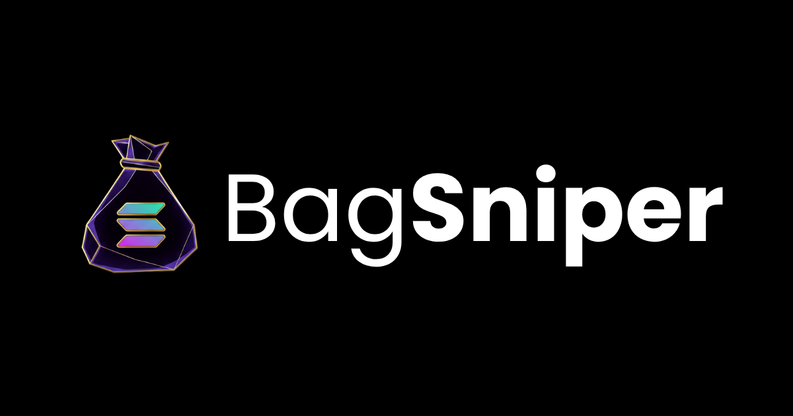

# BagSniper 🎯

A modern, high-performance trading bot interface built for Solana ecosystem token sniping and trading. BagSniper provides lightning-fast mint detection, automated liquidity pool sniping, and advanced trading features with a sleek, responsive web interface.



## Features ✨

- **Lightning-Fast Mint Sniping** - Auto-buy unreleased tokens the moment their liquidity pool launches
- **Advanced Trading Tools** - Real-time monitoring, position tracking, and risk management
- **Responsive Design** - Optimized for desktop and mobile devices
- **Dark Mode Support** - Eye-friendly interface with theme persistence
- **Telegram Integration** - Connect with the BagSniper bot directly via Telegram
- **Rewards System** - Track and manage trading rewards and referral bonuses
- **Documentation & Whitepaper** - Comprehensive guides and tokenomics information

## Tech Stack 🛠️

### Frontend
- **Framework**: [Next.js 14.2](https://nextjs.org/) - React framework with App Router
- **Styling**: [Tailwind CSS 4](https://tailwindcss.com/) - Utility-first CSS framework
- **UI Components**: [Radix UI](https://www.radix-ui.com/) - Unstyled, accessible component library
- **Animations**: [Framer Motion](https://www.framer-motion.com/) - Production-ready motion library
- **Forms**: [React Hook Form](https://react-hook-form.com/) + [Zod](https://zod.dev/) - Type-safe form handling
- **Icons**: [Lucide React](https://lucide.dev/) - Beautiful icon library
- **3D Graphics**: [Cobe](https://cobe.vercel.app/) - 3D globe visualization
- **Charts**: [Recharts](https://recharts.org/) - Composable charting library
- **Notifications**: [Sonner](https://sonner.emilkowal.ski/) - Toast notifications

### Development
- **Language**: [TypeScript](https://www.typescriptlang.org/) - Type-safe JavaScript
- **Package Manager**: [pnpm](https://pnpm.io/)
- **CSS Processing**: [PostCSS](https://postcss.org/)
- **Linting**: ESLint with Next.js configuration

## Getting Started 🚀

### Prerequisites
- Node.js 18+ 
- pnpm (recommended) or npm

### Installation

1. **Clone the repository**
   ```bash
   git clone <repository-url>
   cd bag-sniper
   ```

2. **Install dependencies**
   ```bash
   pnpm install
   ```

3. **Set up environment variables**
   Create a `.env.local` file in the root directory:
   ```env
   # Add any required API keys or configuration here
   ```

4. **Run the development server**
   ```bash
   pnpm dev
   ```

   Open [http://localhost:3000](http://localhost:3000) to view the application.

## Scripts 📋

- `pnpm dev` - Start development server with hot reload
- `pnpm build` - Build for production
- `pnpm start` - Start production server
- `pnpm lint` - Run ESLint to check code quality

## Project Structure 📁

```
bag-sniper/
├── app/                    # Next.js App Router pages
│   ├── page.tsx           # Home page
│   ├── layout.tsx         # Root layout wrapper
│   ├── login/             # Authentication pages
│   ├── signup/            # Registration pages
│   ├── rewards/           # Rewards dashboard
│   ├── whitepaper/        # Whitepaper documentation
│   ├── docs/              # User documentation
│   ├── api/               # API routes (backend)
│   └── globals.css        # Global styles
├── components/            # React components
│   ├── ui/               # Radix UI based components
│   ├── magicui/          # Magic UI components
│   ├── hero.tsx          # Hero section
│   ├── features.tsx      # Features showcase
│   ├── tokenomics-section.tsx
│   ├── roadmap-section.tsx
│   ├── pricing-section.tsx
│   ├── faq-section.tsx
│   └── testimonials.tsx
├── lib/                  # Utility functions
│   ├── utils.ts         # Helper functions
│   ├── fonts.ts         # Font definitions
│   └── load-script.ts   # Script loading utilities
├── hooks/               # React hooks
│   ├── use-toast.ts     # Toast notifications
│   └── use-mobile.ts    # Mobile detection
├── public/              # Static assets
│   ├── logo.png
│   ├── bagsniper-hero-banner.png
│   └── ...
├── styles/              # Global stylesheets
├── package.json
├── tsconfig.json
├── next.config.mjs
├── postcss.config.mjs
└── components.json      # shadcn/ui configuration
```

## Key Pages 📄

- **Home** (`/`) - Landing page with hero, features, tokenomics, and roadmap
- **Login** (`/login`) - User authentication
- **Signup** (`/signup`) - New user registration
- **Rewards** (`/rewards`) - Rewards tracking and management
- **Whitepaper** (`/whitepaper`) - Detailed project documentation
- **Documentation** (`/docs`) - User guides and API documentation

## Configuration Files

### `next.config.mjs`
Next.js configuration for production optimization and build settings.

### `tsconfig.json`
TypeScript compiler options and path aliases for cleaner imports.

### `postcss.config.mjs`
PostCSS plugins configuration (Tailwind CSS integration).

### `components.json`
shadcn/ui component configuration and styling preferences.

## Styling 🎨

The project uses:
- **Tailwind CSS v4** with custom theming
- **CSS Variables** for dynamic theme switching
- **Dark mode first** design philosophy
- **Responsive breakpoints**: sm (640px), md (768px), lg (1024px), xl (1280px)

### Theme Variables
Global CSS variables are defined in `app/globals.css` for color schemes and can be customized via the theme system.

## API Routes 🔌

### `/api/revshare`
Manages revenue share and rewards calculations for users.

## Deployment 🌐

### Build for Production
```bash
pnpm build
pnpm start
```

### Deploy to Vercel (Recommended)
```bash
vercel deploy
```

The project is optimized for [Vercel](https://vercel.com/) deployment with:
- Automatic preview deployments
- Edge function support
- Analytics integration
- Image optimization

## External Links 🔗

- **Twitter/X**: [@BagSniperSOL](https://x.com/BagSniperSOL)
- **Telegram**: [bagsniper_app](https://t.me/bagsniper_app)
- **Telegram Bot**: [@BagSniperBot](https://t.me/BagSniperBot)

## Dependencies Overview 📦

### Core Dependencies
- `next` - React framework
- `react` & `react-dom` - UI library
- `tailwindcss` - Utility CSS
- `framer-motion` - Animations

### UI & Form Libraries
- `@radix-ui/*` - Headless UI components
- `react-hook-form` - Form state management
- `zod` - Schema validation
- `cmdk` - Command menu component

### Data & Visualization
- `recharts` - Data visualization
- `date-fns` - Date utilities
- `cobe` - 3D globe

### Utilities
- `clsx` - Conditional classnames
- `tailwind-merge` - Tailwind utilities merging
- `lucide-react` - Icon library
- `sonner` - Toast notifications

## Development Tips 💡

1. **Component Development**: Use Radix UI as a base for all UI components
2. **Styling**: Leverage Tailwind CSS utility classes with CSS variables for theming
3. **Forms**: Implement forms with React Hook Form for better performance
4. **Type Safety**: Always define proper TypeScript types for props and state
5. **Responsive Design**: Design mobile-first, then enhance for larger screens
6. **Performance**: Use Next.js Image component for optimized images

## Browser Support 🌐

- Chrome (latest)
- Firefox (latest)
- Safari (latest)
- Edge (latest)

## Contributing 🤝

Contributions are welcome! Please ensure:
- Code follows the existing style
- Components are properly typed with TypeScript
- New features include documentation
- Changes are tested on mobile and desktop views

## License 📜

[Specify your license here]

## Support & Community 💬

- **Documentation**: Visit `/docs` for comprehensive guides
- **Whitepaper**: Read `/whitepaper` for technical details
- **Telegram**: Join [@BagSniperBot](https://t.me/BagSniperBot) for support
- **Twitter**: Follow [@BagSniperSOL](https://x.com/BagSniperSOL) for updates

---

**Made with ❤️ for the Solana community**
